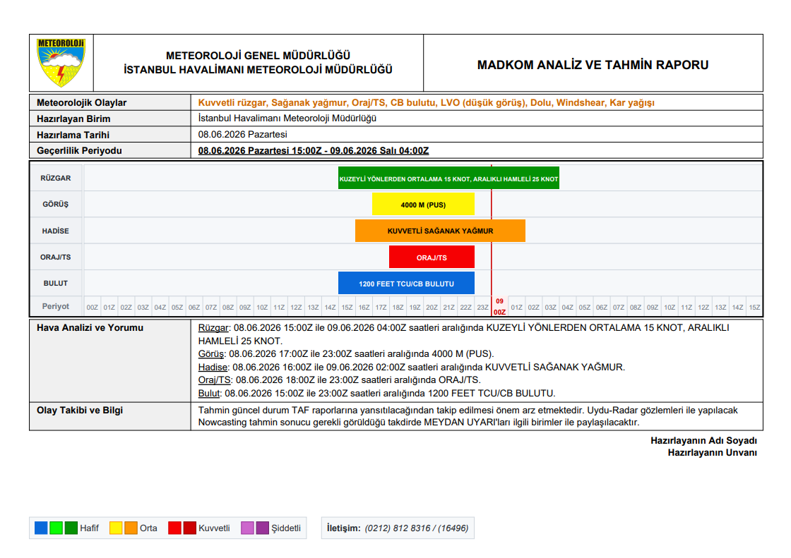
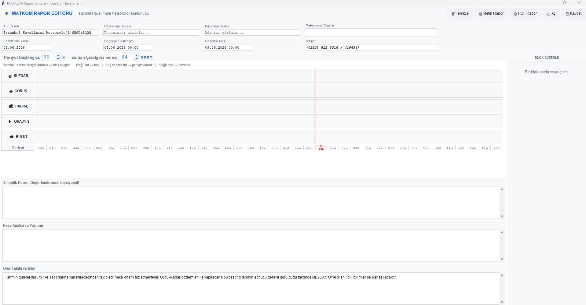

# MADKOM — Meteoroloji Analiz ve Tahmin Rapor Editörü

Havalimanı meteoroloji müdürlükleri için geliştirilmiş masaüstü rapor hazırlama aracı.  
Zaman çizelgesi tabanlı arayüzden doğrudan **PDF çıktısı** üretir.

---

## PDF Çıktısı

### Sinoptik Değerlendirmeli Rapor

### Standart Rapor

---

## Arayüz

### Doldurulmuş Rapor

### Boş Arayüz

---

## Özellikler

- Rüzgar, görüş, hadise, oraj/TS ve bulut katmanları için zaman çizelgesi editörü
- Hafif / Orta / Kuvvetli / Şiddetli yoğunluk renk kodlaması
- Sinoptik durum değerlendirmesi, hava analizi ve olay takibi alanları
- Metin rapor ve PDF rapor çıktısı
- Windows ve macOS desteği

---

## Kurulum

### Windows
`Windows/MADKOM editörü/` klasöründeki dosyaları çalıştırın.

### macOS
`macOS/MADKOM editörü/` klasöründeki dosyaları çalıştırın.

---

## Gereksinimler

- Python 3.x
- Bağımlılıklar: `pdf_generator.py`, `ui_editor.py`, `timeline_canvas.py`
